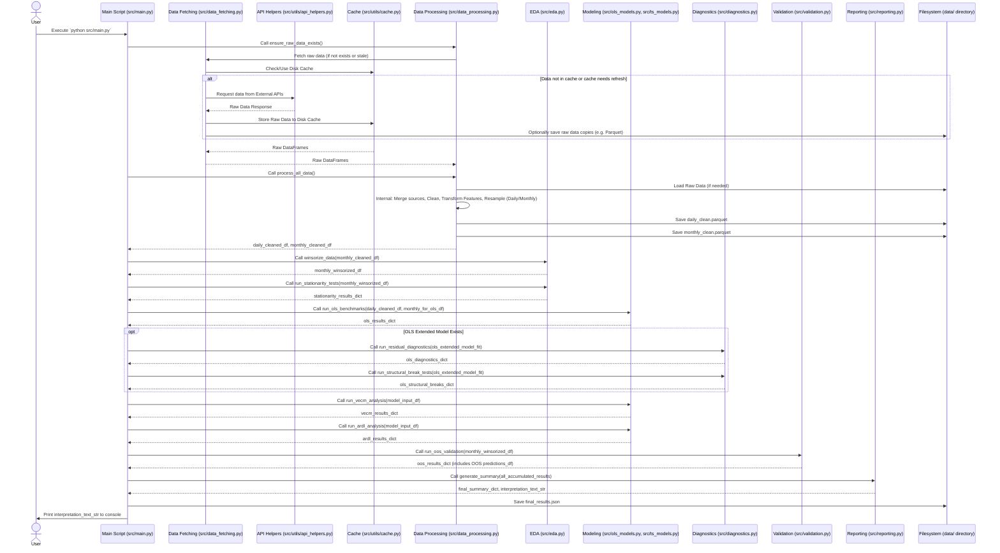

# Data Flow Diagram

This diagram details the sequence of operations and data transformations within the `ethereum_project` pipeline when `src/main.py` is executed.

This sequence illustrates the interaction between different modules, data caching, file system operations for storing intermediate and final results, and the eventual output to the user. 